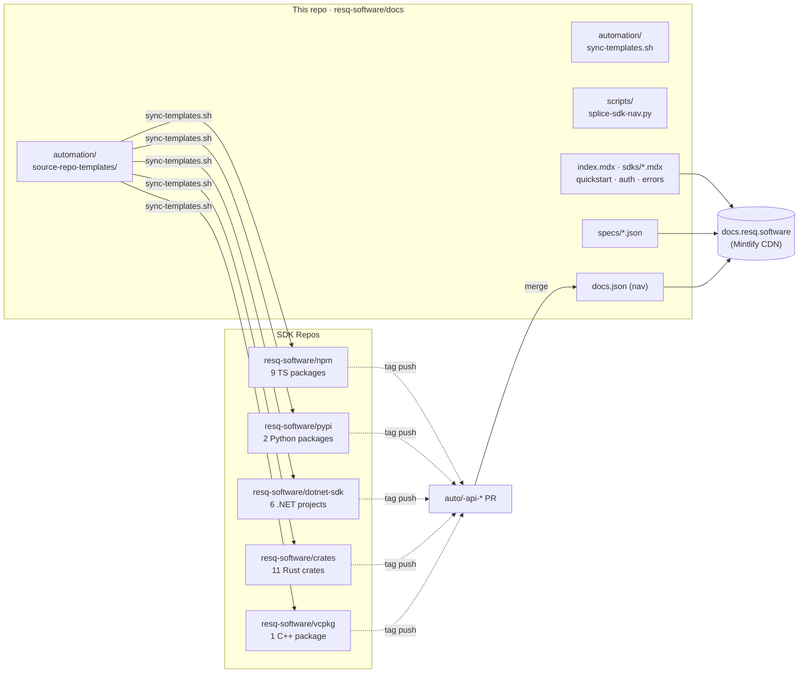

# ResQ Docs

[](https://mintlify.com)
[](https://docs.resq.software)
[](LICENSE)
[](docs.json)

> Official documentation for **ResQ Tactical OS** — the decentralized kinetic operating system for autonomous disaster response. Mesh-networked coordination when infrastructure fails. Built with Mintlify, MDX, OpenAPI, and a cross-repo auto-doc pipeline that pulls API references from five SDK source repos.

This repository is **two things at once**:

1. **A Mintlify docs site** — hand-written prose, OpenAPI references, design assets, all five locales.
2. **An auto-doc orchestrator** — workflow templates that live here, deploy to each SDK repo, and open PRs back here whenever a release tag fires.



## Repository layout

| Path | What lives here |
| :--- | :--- |
| `index.mdx`, `quickstart.mdx`, `authentication.mdx`, `errors.mdx`, `concepts.mdx` | Hand-written entry-point pages |
| `sdks/<lang>.mdx` | One landing page per SDK (TS, Python, Rust, .NET, C++) |
| `sdks/<lang>/api/` | **Auto-generated** SDK API references — do not edit by hand |
| `api-reference/` | OpenAPI-driven REST API reference pages |
| `specs/*.json` | OpenAPI 3.x specs for ResQ services |
| `automation/source-repo-templates/` | Canonical workflow YAML for each SDK pipeline |
| `automation/sync-templates.sh` | Pushes the canonical templates into every SDK repo |
| `scripts/splice-sdk-nav.py` | Local helper to rebuild `docs.json`'s SDK nav from `_pages.json` artifacts |
| `docs.json` | Mintlify navigation, theming, redirects, locale config |
| `assets/`, `og-banner.png`, `og-backdrop.png` | Branding |
| `pwa/`, `manifest.webmanifest`, `custom.css` | PWA + theme overrides |
| `es/`, `zh/`, `ar/`, `hi/` | Translated mirrors (kept in lock-step with the English root) |

## Local development

**Prerequisites:** Node.js v19+ (Mintlify's `mint` CLI requires it).

```bash
# Install the Mintlify CLI
npm i -g mint

# Clone and enter
git clone https://github.com/resq-software/docs.git
cd docs

# Start the local preview
mint dev               # default port 3000
# or pin a port if 3000 is busy:
mint dev --port 3334
```

Open the printed URL. Hot-reload picks up edits to `.mdx`, `docs.json`, and any synced markdown under `sdks/<lang>/api/`.

**Validate locally before pushing:**

```bash
mint broken-links      # flags any nav-registered page or in-content link that 404s
```

## Auto-doc pipeline

The five SDK source repos each carry a copy of the workflow at `automation/source-repo-templates/api-docs.<lang>.yml`. That workflow:

1. Triggers on tag push (e.g. `@resq-sw/ui@v0.35.6`, `v1.3.3`, `@resq-sw/*@v*`) **or** manual `workflow_dispatch`.
2. Generates language-native markdown:

   | Repo | Lang | Tooling |
   | :--- | :--- | :--- |
   | `resq-software/npm` | TypeScript | TypeDoc + `typedoc-plugin-markdown` (per-package) |
   | `resq-software/pypi` | Python | `pydoc-markdown` (per-submodule) |
   | `resq-software/dotnet-sdk` | C# / .NET | `DefaultDocumentation` |
   | `resq-software/crates` | Rust | `cargo-doc-md` (rustdoc JSON → markdown) for libs; README stub for binaries |
   | `resq-software/vcpkg` | C++ | Doxygen → moxygen |

3. Post-processes the output uniformly: rename `README.md` → `index.md`, prefix bare relative links with `./`, strip `.md` extensions from link targets, escape MDX-unsafe characters (`{ }`, `<`), inject a version banner from package metadata, build a hierarchical `_pages.json` index.
4. Splices the new pages into the matching language sub-group inside `docs.json`'s "Generated Package References" group.
5. Opens an auto-PR against this repo on a `auto/<lang>-api-<ref>` branch with `add-paths: sdks/<lang>/api/** + docs.json`.
6. A maintainer reviews + merges. Mintlify rebuilds.

### Updating a template

Templates here are the source of truth. After editing, sync to every SDK repo with:

```bash
automation/sync-templates.sh                    # all five
automation/sync-templates.sh --dry-run          # preview diffs only
automation/sync-templates.sh python             # one language
automation/sync-templates.sh --auto-merge       # open PRs with --auto
```

### Adding a new SDK

1. Drop `automation/source-repo-templates/api-docs.<lang>.yml` (use an existing one as a starting point).
2. Add a new entry to the `TARGETS` table in `automation/sync-templates.sh` with the source repo and default branch.
3. Add a new `lang_specs` entry to `scripts/splice-sdk-nav.py` so local re-splices include it.
4. Create `sdks/<lang>.mdx` (the landing page) and add it to the `Languages` group in `docs.json`.
5. Run `automation/sync-templates.sh <lang>` once after the source repo accepts the workflow.

The first workflow run will create the language sub-group under "Generated Package References" automatically; subsequent runs just rewrite it.

## Writing prose

Pages are `.mdx` with YAML frontmatter:

```mdx
---
title: 'Your Page Title'
description: 'One-line description shown in search and cards'
---

Full MDX. Use Mintlify's built-ins (`<Card>`, `<Tabs>`, `<CodeGroup>`, `<Note>`, `<Warning>`),
mermaid code fences, or import a custom component.
```

Add a new page by creating the `.mdx` file, then adding its path (no extension) to the appropriate group in `docs.json`'s `navigation.tabs[*].groups[*].pages`.

OpenAPI reference pages point to a spec:

```mdx
---
title: My Service API
openapi: ../specs/my-service.json
---
```

Drop new specs in `specs/` and reference them the same way.

### MDX gotchas

| Symbol in prose | Why it breaks | Fix |
| :--- | :--- | :--- |
| `{` or `}` | MDX parses as JSX expression | Wrap in backticks: `` `{` `` |
| `<X>` (X starts with letter) | Parses as JSX component reference | Wrap in backticks: `` `<X>` `` |
| `<` followed by digit / `=` / space | Acorn errors before name | Same — backtick or `&lt;` |
| `[label](file.md)` | Mintlify routes `.md` literally → 404 | Drop extension: `[label](file)` |

The auto-doc post-processors handle these for generated content; you only need to remember them for hand-written prose.

## Internationalization

Translated mirrors live in `es/`, `zh/`, `ar/`, `hi/`. Each carries the same path structure as English. The `locale parity` CI check reports every English page that has no counterpart in a locale, and every counterpart that is *structurally short* — fewer code blocks, headings, or components than the English page. A file that exists but dropped its examples is a gap too, and the check names it.

Run it locally before opening a PR:

```bash
python3 scripts/i18n_parity.py --root .
```

Prose length is not compared; translations legitimately vary in length. Code examples do not.

When you add an English page, either:
- Translate it into all four other locales **before** merging, or
- Add the path to `.i18n-exempt` with the reason as an inline comment.

`.i18n-exempt` takes one repo-relative path per line; `#` starts a comment.
Exempt pages are listed separately in the report instead of counting as gaps:

```text
changelog.mdx  # append-only release log; every entry would need 4 translations forever
```

Exempt a page only when translating it is genuinely impractical. A page that is
merely untranslated *yet* should stay in the gap list so it keeps showing up.

## Validation

| Check | Command | When |
| :--- | :--- | :--- |
| Mintlify build (broken links, frontmatter) | `mint broken-links` | Before every push |
| OpenAPI lint | runs in CI via `spectral` | On every PR |
| PWA manifest | runs in CI | On every PR |
| Locale parity | runs in CI | On every PR |
| CodeQL (actions, python) | runs in CI | On every PR |

## Deployment

Push to `main` — the Mintlify GitHub App detects the push, builds, and deploys to the production CDN. No manual step required.

## Troubleshooting

| Problem | Fix |
| :--- | :--- |
| Preview won't start | Delete `~/.mintlify` cache and re-run `mint dev` |
| `sharp` module errors | Ensure Node v19+ and reinstall the CLI |
| `mint broken-links` fails on `.md` link targets | Re-run the matching language's `Strip .md extension` post-process step (or just regenerate via the SDK workflow) |
| Auto-PR has empty content but `pull-request-operation = none` in the run log | The diff fell outside the workflow's `add-paths`. Check that the new files land under `sdks/<lang>/api/**` |
| Mintlify warns "file does not exist" for a registered page | The splice probably stripped `/index` from a path whose file isn't at `dir/index.md`. Either rename the file or fix the splice's strip rules |
| sync-templates.sh reports "up-to-date" but no template exists in the target | Check that the target repo's default branch matches the branch hardcoded in `TARGETS` (npm uses `master`, others use `main`) |

## Contributing

1. Fork and branch: `docs/your-topic`
2. `mint dev` to preview locally
3. `mint broken-links` to validate
4. Open a PR — describe **what** changed and **why** it changed

Active voice. Short sentences. If documenting an API, verify the endpoint behavior against the running service first.

See [`AGENTS.md`](AGENTS.md) for project-specific instructions when collaborating with AI agents on this repo, and [`CONTRIBUTING.md`](CONTRIBUTING.md) for the longer style guide.

## License

Copyright 2026 ResQ. Licensed under the [Apache License, Version 2.0](LICENSE).
