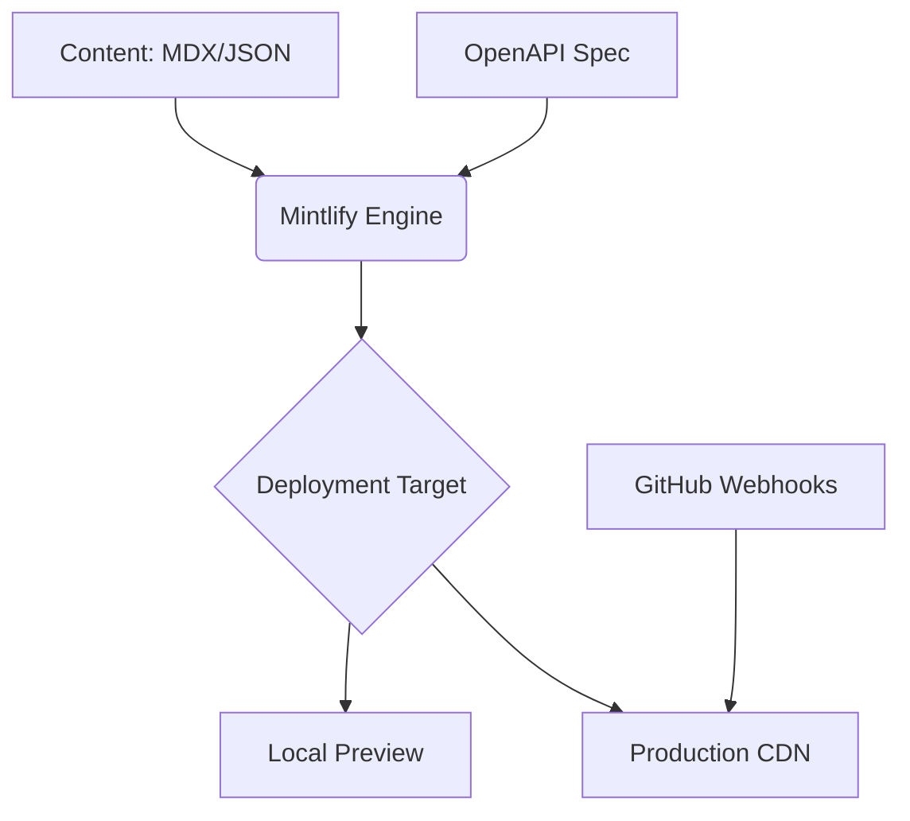

# ResQ Documentation Starter Kit


The ResQ Documentation project provides a standardized framework for managing, versioning, and deploying technical documentation. Built on the Mintlify ecosystem, this repository supports MDX-based content, automated API documentation, and seamless AI-assisted integration.

## Table of Contents

- [Overview](#overview)
- [Features](#features)
- [Architecture](#architecture)
- [Quick Start](#quick-start)
- [Usage](#usage)
- [Configuration](#configuration)
- [API Reference](#api-reference)
- [Development](#development)
- [Contributing](#contributing)
- [Roadmap](#roadmap)
- [License](#license)

## Overview

ResQ Documentation is designed to minimize the friction between writing code and documenting it. By leveraging MDX, we allow for dynamic, interactive documentation that supports custom components, code highlighting, and live previews.

## Features

- **MDX Support**: Combine Markdown with React components for rich, interactive docs.
- **AI-Ready**: Pre-configured for integration with Cursor, Claude Code, and Windsurf.
- **Automated API Docs**: Generate interactive API references from OpenAPI specifications.
- **Localized Preview**: Real-time rendering via the Mintlify CLI.
- **Automated Validation**: Integrated link checking and deployment validation.

## Architecture

The system follows a headless documentation pattern, where content is authored in MDX and compiled via the Mintlify engine.



## Quick Start

Get your environment running in minutes:

1. **Install CLI**:
   ```bash
   npm i -g mint
   ```
2. **Launch Preview**:
   ```bash
   mint dev
   ```
3. **Access**: Navigate to `http://localhost:3000` to view your documentation.

## Usage

### Writing Content
Pages are stored in the root directory and sub-folders as `.mdx` files. Use standard Markdown for text and include YAML frontmatter for metadata:

```md
---
title: 'Page Title'
description: 'Brief description of page content'
---

# Heading
Content goes here.
```

### AI Assistance
To optimize your writing workflow, add the documentation skill to your AI coding tools:

```bash
npx skills add https://mintlify.com/docs
```

## Configuration

The documentation behavior, styling, and navigation are controlled via `docs.json`.

```json
{
  "name": "ResQ Docs",
  "theme": "mint",
  "colors": {
    "primary": "#3B82F6",
    "light": "#60A5FA",
    "dark": "#1E40AF"
  }
}
```

- **Theme**: Configures the primary color palette and branding.
- **Navigation**: Define the hierarchy of your documentation tabs and sidebar groups.
- **Favicon**: Path to your organization's logo or icon.

## API Reference

The documentation includes built-in support for OpenAPI specifications. 

- **Structure**: API documentation is located in `api-reference/`.
- **Automatic Generation**: Place your `openapi.json` in the spec directory; Mintlify will automatically generate endpoints, request schemas, and response samples.
- **Endpoints**: Use the `api-reference/endpoint/` folder to manually define custom logic or edge-case documentation.

## Development

### Best Practices
- **Linking**: Always use relative paths for internal links.
- **Validation**: Before committing, run `mint broken-links` to ensure documentation integrity.
- **Formatting**: Use the [MDX VSCode extension](https://marketplace.visualstudio.com/items?itemName=unifiedjs.vscode-mdx) for syntax highlighting.

### Troubleshooting
- **Port Conflicts**: If port 3000 is occupied, use `mint dev --port 3333`.
- **Cache Issues**: If you experience rendering errors, delete the `~/.mintlify` folder and restart the CLI.

## Contributing

We welcome contributions to improve our documentation. 

1. **Fork the Repository**: Create your own version of the repo.
2. **Branching**: Create a feature branch for your updates.
3. **Drafting**: Use the [Development Guide](/development.mdx) to preview your changes.
4. **Pull Request**: Submit your changes, ensuring you have followed the style guidelines (Active voice, concise sentences).

## Roadmap

- [ ] Add search indexing for enterprise users.
- [ ] Implement dark mode toggle customization.
- [ ] Expand API reference to support SDK generation.
- [ ] Integrate automated accessibility (A11y) testing.

## License

This project is licensed under the MIT License. See the [LICENSE](LICENSE) file for details.