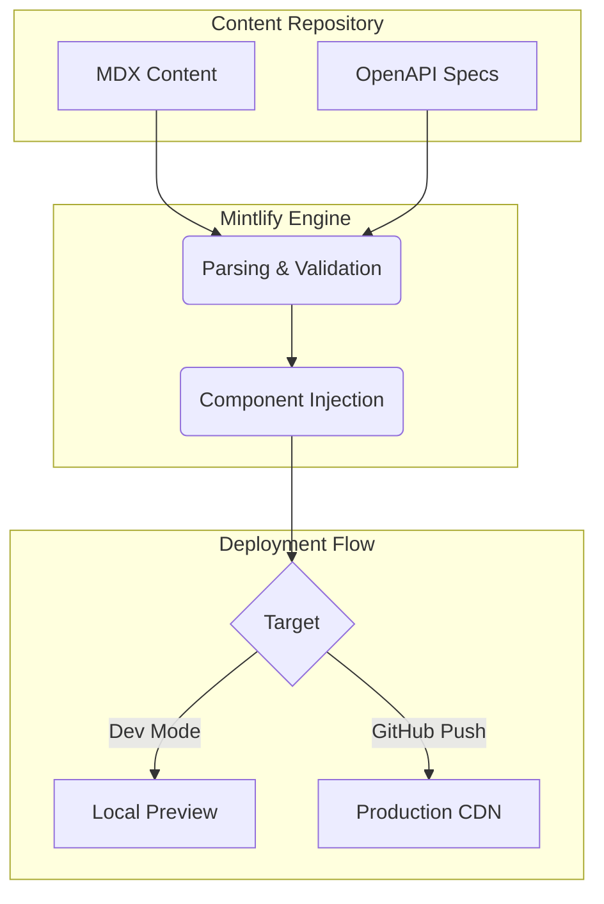

# ResQ Documentation Starter Kit


A standardized, AI-ready framework for managing and deploying technical documentation using Mintlify.

## Overview

ResQ Documentation is a headless, MDX-based framework designed to minimize the friction between writing code and maintaining documentation. It integrates directly with AI coding agents and provides automated pipelines for OpenAPI-based API references.

## Features

- **MDX Support**: Combine Markdown with React components for rich, interactive documentation.
- **AI-Ready**: Native configuration for integration with Cursor, Claude Code, and Windsurf via specialized skill sets.
- **Automated API Docs**: Generate interactive API references directly from your OpenAPI specifications.
- **Localized Preview**: Real-time rendering via the Mintlify CLI.
- **Validation**: Automated broken-link checking and deployment validation.

## Architecture

The ResQ documentation ecosystem utilizes a headless approach where MDX source files and OpenAPI specifications serve as the "single source of truth." The Mintlify engine compiles these sources into a high-performance documentation site.



## Installation

1. **Prerequisites**: Ensure you have Node.js (v19+) installed.
2. **Install CLI**:
   ```bash
   npm i -g mint
   ```

## Quick Start

1. **Launch Local Preview**:
   ```bash
   mint dev
   ```
2. **Access**: Navigate to `http://localhost:3000` in your browser.
3. **Validate**: Run `mint broken-links` to ensure documentation integrity before committing changes.

## Usage

### Writing Content
Pages are maintained as `.mdx` files in the root or sub-directories. Use YAML frontmatter to define page metadata:

```md
---
title: 'Page Title'
description: 'Brief description of page content'
---

# Heading
Content goes here.
```

### AI Assistance
To integrate the documentation context into your AI coding tool:

```bash
npx skills add https://mintlify.com/docs
```

## Configuration

Control the documentation's behavior, branding, and navigation structure via the `docs.json` file in the root directory.

```json
{
  "name": "ResQ Docs",
  "theme": "mint",
  "colors": {
    "primary": "#3B82F6"
  }
}
```

## API Reference

API documentation is generated from OpenAPI specifications.
- **Structure**: Place your `openapi.json` files in the `specs/` directory.
- **Endpoints**: Reference these specs in your `api-reference/` files to generate auto-styled interactive endpoints.

## Development

- **Formatting**: We recommend the [MDX VSCode extension](https://marketplace.visualstudio.com/items?itemName=unifiedjs.vscode-mdx).
- **Naming**: Use absolute paths for all links to optimize performance.
- **Troubleshooting**: If the preview fails, delete the local `~/.mintlify` cache folder and restart the CLI.

## Deployment Strategies

The system supports automated deployments through the Mintlify GitHub App:
1. **Push**: Commit changes to your `main` branch.
2. **Webhook**: The GitHub app triggers a build on the Mintlify CDN.
3. **Validation**: The build pipeline automatically runs syntax and link-integrity checks.
4. **Live**: Changes propagate to the production URL within seconds.

## Contributing

1. **Fork**: Create a fork of the `resq-software/docs` repository.
2. **Branch**: Create a feature branch for your changes.
3. **Preview**: Verify your updates locally using `mint dev`.
4. **Pull Request**: Submit a PR, ensuring all content follows the project's style guide (Active voice, concise sentences).

## License

This project is licensed under the MIT License. See the [LICENSE](LICENSE) file for details.