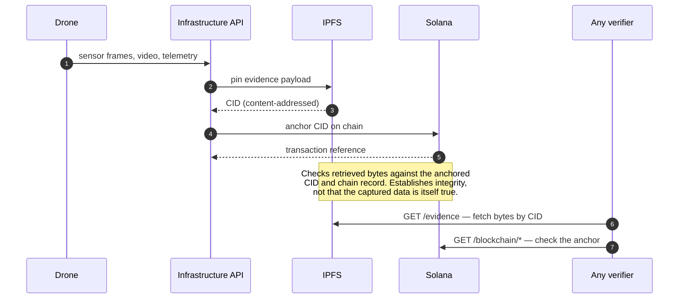

```mermaid
sequenceDiagram
  autonumber
  participant D as Drone
  participant API as Infrastructure API
  participant IPFS
  participant SOL as Solana
  participant V as Any verifier

  D->>API: sensor frames, video, telemetry
  API->>IPFS: pin evidence payload
  IPFS-->>API: CID (content-addressed)
  API->>SOL: anchor CID on chain
  SOL-->>API: transaction reference

  Note over IPFS,SOL: Checks retrieved bytes against the anchored<br/>CID and chain record. Establishes integrity,<br/>not that the captured data is itself true.

  V->>IPFS: GET /evidence — fetch bytes by CID
  V->>SOL: GET /blockchain/* — check the anchor
```
