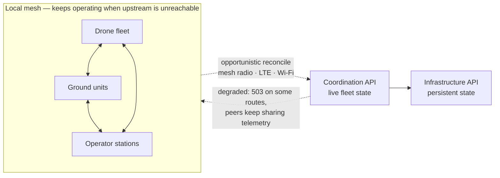

```mermaid
flowchart LR
  subgraph mesh["Local mesh — keeps operating when upstream is unreachable"]
    direction TB
    D["Drone fleet"] <--> G["Ground units"]
    G <--> O["Operator stations"]
    D <--> O
  end

  mesh -. "opportunistic reconcile<br/>mesh radio · LTE · Wi-Fi" .-> C["Coordination API<br/>live fleet state"]
  C --> I["Infrastructure API<br/>persistent state"]

  C -. "degraded: 503 on some routes,<br/>peers keep sharing telemetry" .-> mesh
```
