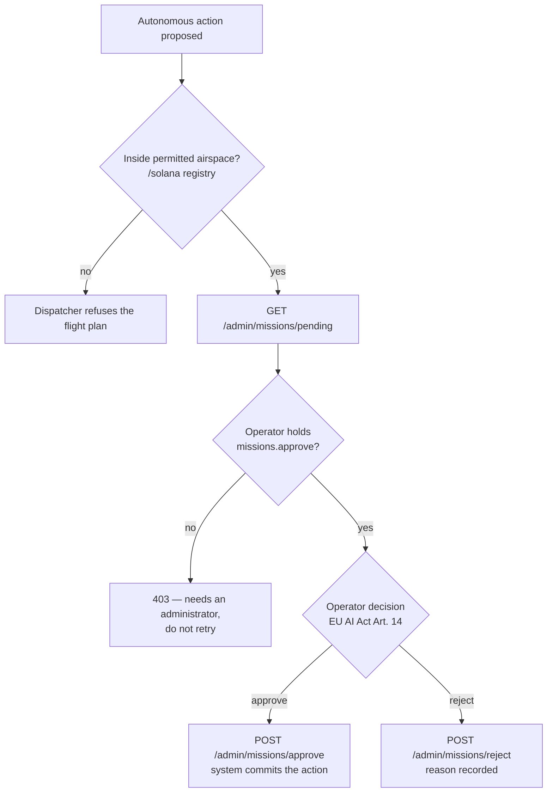

```mermaid
flowchart TD
  P["Autonomous action proposed"] --> A{"Inside permitted airspace?<br/>/solana registry"}
  A -- no --> RJ["Dispatcher refuses the flight plan"]
  A -- yes --> Q["GET /admin/missions/pending"]

  Q --> S{"Operator holds<br/>missions.approve?"}
  S -- no --> F["403 — needs an administrator,<br/>do not retry"]
  S -- yes --> DEC{"Operator decision<br/>EU AI Act Art. 14"}

  DEC -- approve --> OK["POST /admin/missions/approve<br/>system commits the action"]
  DEC -- reject --> NO["POST /admin/missions/reject<br/>reason recorded"]
```
